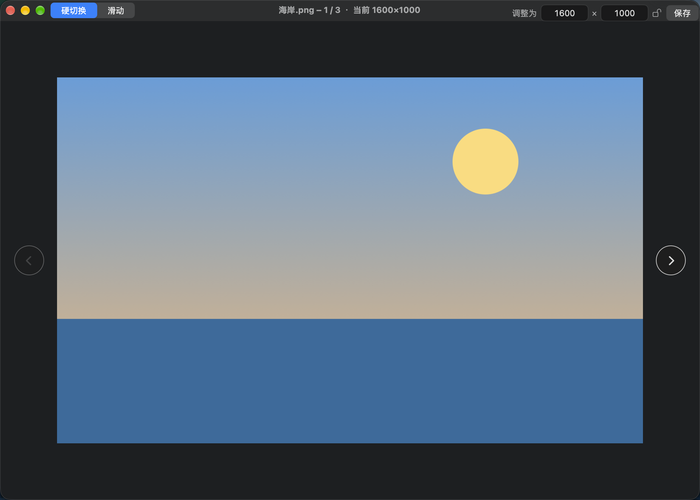
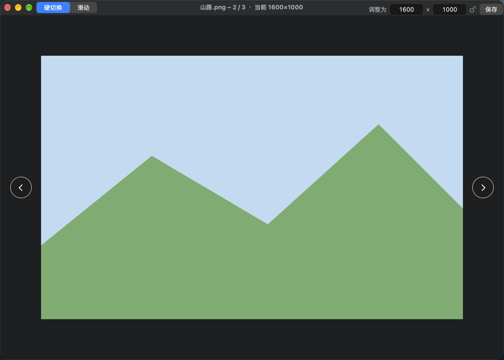
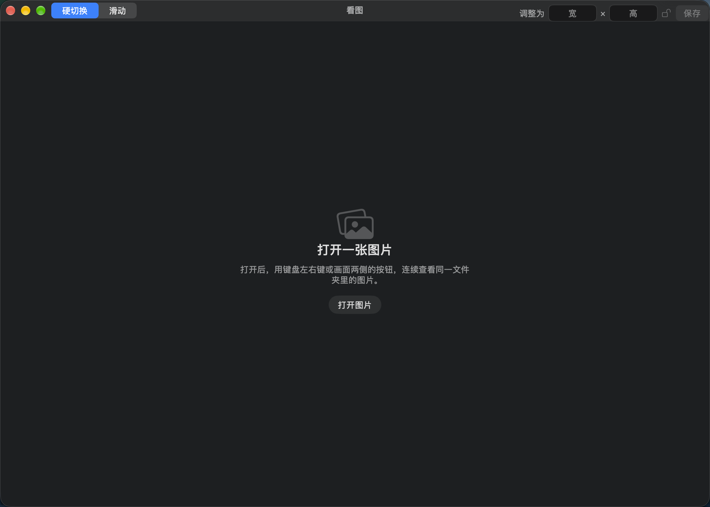

# 看图

macOS 上的轻量看图工具。打开一张图片后，可以连续查看它所在文件夹里的全部图片，也能把当前图片调整到指定分辨率再另存。

## 界面

打开图片后，文件名显示在窗口上方，右侧是序号和当前像素尺寸。左右方向键或画面两侧的按钮用来翻页。



翻到下一张时，标题会换成新的文件名和分辨率。到第一张或最后一张就不能再翻。



没有打开图片时，可以把文件拖进窗口，或点「打开图片」。



## 功能

- 打开一张图片后，按文件名顺序浏览同一文件夹里的图片。支持拖入、菜单「文件 → 打开」，也可以从访达里用「打开方式」选择看图。
- 用键盘左右方向键，或画面两侧的按钮翻页。
- 左上角切换翻页方式：**硬切换**直接换图，**滑动**从一侧滑入。按住方向键连续翻时会直接换图，避免动画叠在一起。
- 右上角输入宽和高（像素），点「保存」后选择文件夹。图片会按这个尺寸写出，原图不会被改掉。
- 锁图标可以锁定宽高比例。改一边时，另一边按当前图片的比例跟着变。
- 若目标文件夹里已有同名文件，可以选择保留两者或替换。保存到原图所在位置且文件名相同时，会自动加上分辨率后缀，避免覆盖正在查看的文件。

标题中间是文件的实际分辨率。右上角输入的是准备保存的尺寸，例如把 1600×1000 调整为 1280×800：


可打开的格式：JPEG、PNG、GIF、BMP、TIFF、HEIC、WebP、AVIF 等常见图片。保存时 JPEG、PNG、TIFF、HEIC 会沿用原来的格式，其余格式保存为 PNG。

## 环境

- macOS 13 或更高版本
- 编译需要 Xcode 命令行工具（`swiftc`、`iconutil`）

## 编译

在本目录执行：

```bash
./build.sh
```

脚本会编译应用、生成图标并做一次自测。完成后，应用出现在上一级目录：`看图.app`。

## 使用

直接打开 `看图.app`，或在终端把图片交给它：

```bash
open -a 看图.app ~/Pictures/example.jpg
```
